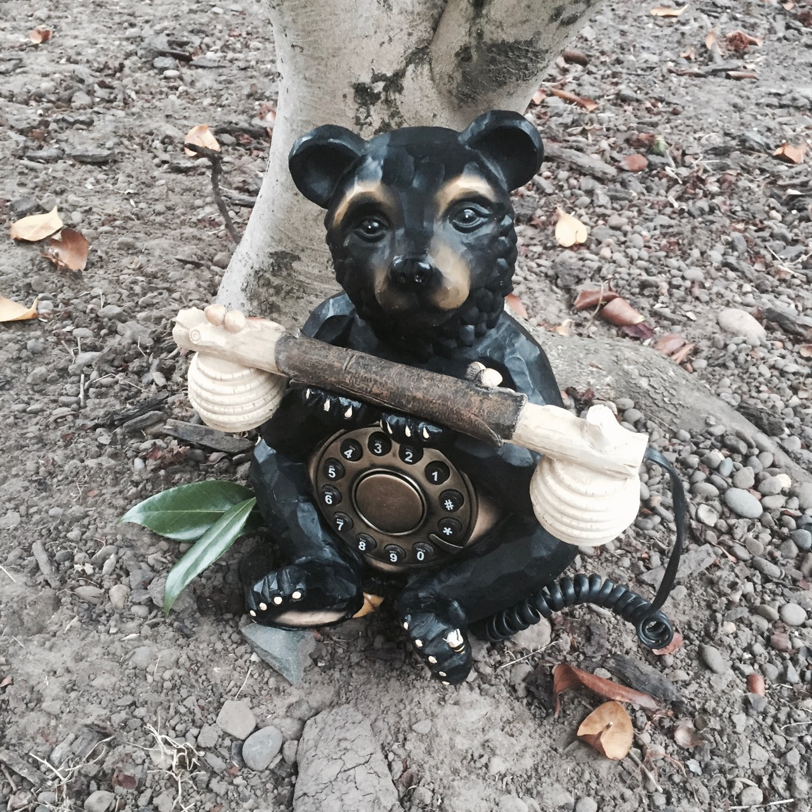

# kumaden
A Raspberry Pi interactive art project.

A bear's phone reads tweets from [@A_single_bear](http://twitter.com/A_single_bear/),
with [bear/python-twitter](https://github.com/bear/python-twitter/).

Telephone tones from user [Psyche_Sound_Studios](http://freesound.org/people/Psyche_Sound_Studios/) at [freesound.org](http://freesound.org).

Requirements
============
* [matrix_keypad](https://pypi.python.org/pypi/matrix_keypad)
* [flite](http://www.speech.cs.cmu.edu/flite/)
* [python-twitter](https://github.com/bear/python-twitter)
* [pyaudio](http://people.csail.mit.edu/hubert/pyaudio/)
